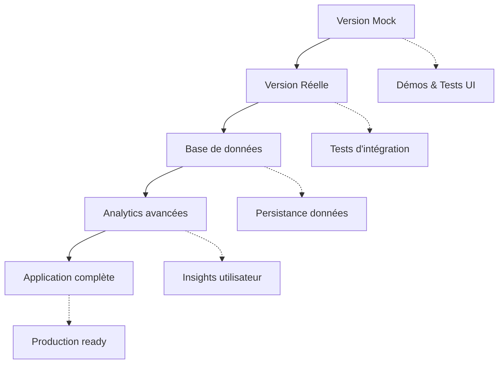

# 🆚 Version Comparaison : Mock vs Real

## 📊 **État Actuel du Projet**

Vous avez maintenant **DEUX versions** de l'application :

| Fonctionnalité           | Version Mock (`dev-server`) | Version Réelle (`real-server`)  |
| ------------------------ | --------------------------- | ------------------------------- |
| **API Riot**             | ❌ Données hardcodées       | ✅ Vraie API Riot Games         |
| **Validation de compte** | ❌ Accepte tout             | ✅ Vérification réelle          |
| **Matchs**               | ❌ 3 matchs fake            | ✅ Vrais matchs récupérés       |
| **Statistiques**         | ❌ Stats inventées          | ✅ Stats calculées depuis l'API |
| **Synchronisation**      | ❌ Simulation               | ✅ Vraie synchronisation        |
| **Base de données**      | ❌ Aucune persistance       | ⚠️ En cours (prochaine étape)   |

---

## 🚀 **Comment démarrer**

### Version Mock (pour les démos)

```powershell
# Compile et démarre avec des données fake
.\dev-server.exe
# http://localhost:8001
```

### Version Réelle (production-ready)

```powershell
# 1. Configurer la clé API Riot
$env:RIOT_API_KEY="RGAPI-votre-clé-ici"

# 2. Compiler et démarrer
.\real-server.exe
# http://localhost:8001
```

---

## 🔧 **Configuration requise**

### Pour la version Mock

- ✅ Aucune configuration requise
- ✅ Fonctionne immédiatement
- ⚠️ Données fictives uniquement

### Pour la version Réelle

- 🔑 **Clé API Riot OBLIGATOIRE**
- 📋 Voir le guide : [RIOT_API_SETUP.md](./RIOT_API_SETUP.md)
- 🧪 Script de test : `.\test-real-api.ps1`

---

## 🎯 **Prochaines étapes de développement**

### Phase 1 : Base de données ✅ EN COURS

- [ ] Schéma PostgreSQL complet
- [ ] Migration des utilisateurs
- [ ] Persistance des matchs
- [ ] Cache des statistiques

### Phase 2 : Analytics avancées

- [ ] Calculs MMR réels
- [ ] Tendances de performance
- [ ] Analyse par champion
- [ ] Insights IA

### Phase 3 : Fonctionnalités complètes

- [ ] Export Excel avec vraies données
- [ ] Synchronisation automatique
- [ ] Notifications de changement de rang
- [ ] Dashboard temps réel

---

## 🧪 **Tests disponibles**

### Test de l'API Riot

```powershell
# Vérifier que l'API fonctionne
.\test-real-api.ps1
```

### Test de validation de compte

```powershell
# Démarrer le serveur réel
.\real-server.exe

# Dans un autre terminal, tester un compte
Invoke-RestMethod -Uri "http://localhost:8001/api/test/riot" -Method GET
```

### Comparaison Mock vs Real

```powershell
# Terminal 1 : Version mock
.\dev-server.exe

# Terminal 2 : Version réelle
$env:RIOT_API_KEY="votre-clé"
.\real-server.exe
```

---

## 📁 **Structure du projet**

```
lol_match_exporter/
├── cmd/
│   ├── dev-server/          # Version avec données mockées
│   │   └── main.go
│   └── real-server/         # Version avec vraie API Riot
│       └── main.go
├── internal/
│   └── services/
│       └── riot_service.go  # Service API Riot amélioré
├── web/                     # Frontend (même pour les 2)
├── RIOT_API_SETUP.md       # Guide configuration API
├── test-real-api.ps1       # Script de test
└── REAL_IMPLEMENTATION_ROADMAP.md
```

---

## 🎨 **Interface utilisateur**

Le **même frontend React** fonctionne avec les deux versions :

- Détection automatique des fonctionnalités disponibles
- Messages d'erreur adaptés (API non configurée vs données mockées)
- Bascule transparente entre les modes

---

## 💡 **Recommandations d'usage**

### Pour le développement frontend

```powershell
# Utiliser la version mock pour développer l'interface
.\dev-server.exe
```

### Pour tester les intégrations

```powershell
# Utiliser la version réelle avec votre clé API
$env:RIOT_API_KEY="RGAPI-votre-clé"
.\real-server.exe
```

### Pour la production

```powershell
# Version réelle + base de données + Docker
docker-compose -f docker-compose.prod.yml up
```

---

## 🚨 **Points d'attention**

### Version Mock

- ⚠️ **Ne pas utiliser en production**
- ✅ Parfait pour les démos
- ✅ Tests d'interface rapides

### Version Réelle

- 🔑 **Clé API obligatoire**
- ⏱️ **Rate limits à respecter** (100 req/2min)
- 📊 **Données réelles uniquement**

---

## 📈 **Évolution du projet**



**État actuel** : ✅ Version Mock + ✅ Version Réelle  
**Prochaine étape** : 🔄 Base de données + Persistance

---

_Vous êtes maintenant prêt à utiliser la vraie API Riot ! 🎮_
